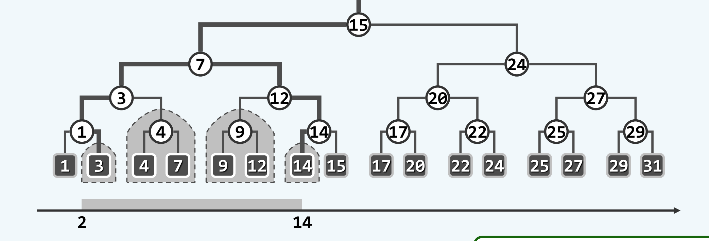
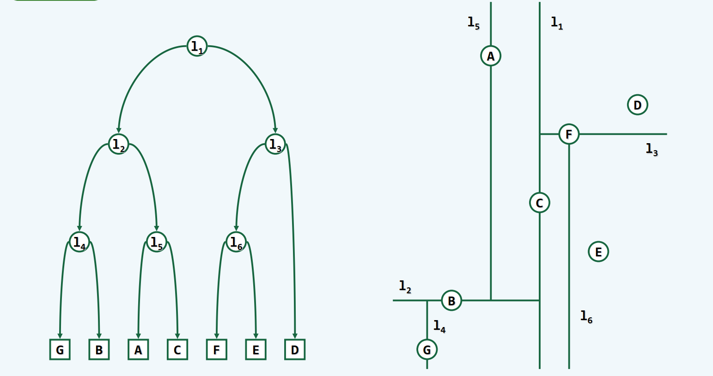
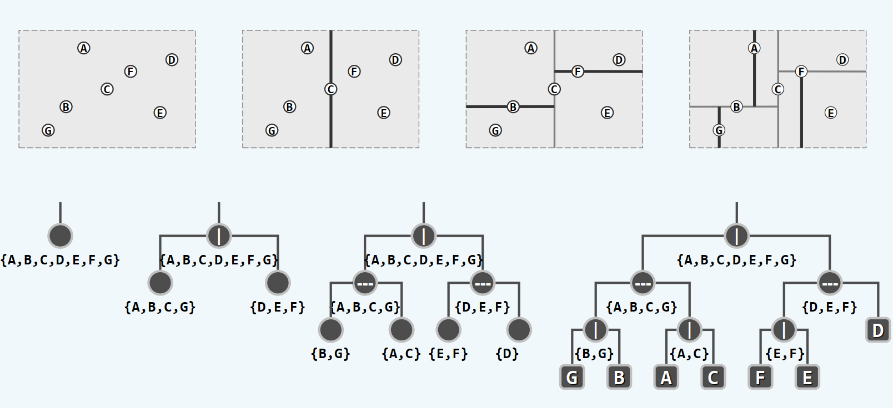

# KD Tree

### 基本原理

- 一维查找：BBST
  
  
  
  查找从m到n的算法:
  
  查找m,n,终止于[m,n]区间边界点m1,n1;
  
  从最低共同祖先（LCA）（7）向下，重走path(m1),path(n1),
  
  一旦左/右拐，输出右/左子树；
  
  （即为两路径所夹着的所有的点）

- 构造算法（PPT里默认把划分点放到左边）

1）构造根结点，使根结点对应于K维空间中包含所有实例点的超矩形区域；

2）通过递归的方法，不断地对k维空间进行切分，生成子结点。在超矩形区域上选择一个坐标轴和在此坐标轴上的一个切分点，确定一个超平面，这个超平面通过选定的切分点并垂直于选定的坐标轴，将当前超矩形区域切分为左右两个子区域（子结点）；这时，实例被分到两个子区域。

3）上述过程直到子区域内没有实例时终止（终止时的结点为叶结点）。在此过程中，将实例保存在相应的结点上。

4）通常，循环的选择坐标轴对空间切分，选择训练实例点在坐标轴上的中位数为切分点，这样得到的kd树是平衡的（平衡二叉树：它是一棵空树，或其左子树和右子树的深度之差的绝对值不超过1，且它的左子树和右子树都是平衡二叉树）。

查找算法

▪从根节点开始查找

▪如果左/右子树与待查找区域有重合，则递归查找左/右子树

▪如果左/右子树被待查区域覆盖，则 report 其中的所有节点

▪如果遍历到叶子节点，判断叶子节点是否属于待查区域，是则 report

#### 如何消除多点共线的情况？

▪其实只是需要找到一个合适的划分的规则

1.引入轻微扰动

2.选择可以比较（方差较大）的维度进行划分

3.排序（x 相同的按照 y 从小到大排序，进而确定 median）
