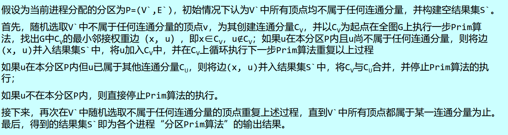

## Parallel MST

### 最小生成树

#### prim算法

建立集合X,Y；

X包含1顶点，Y包含其他顶点；

找到最小权重边(x,y)，将Y移到X；

重复直到Y空，时间复杂度为$O(n^2)$

#### Kruskal算法

1. 将G的边按权重以非降序排列，取出权值最小的边；  

2. 对于排序表中每条边，如果将其加入T后不会形成环，则加入到T；否则，丢弃。

3. 向T中加完n-1条边后算法结束

```cpp
std::mutex mutex;
std::condition_variable cv;
// 条件变量与临界区有关，用来获取和释放一个锁，因此通常会和mutex联用。
std::unique_lock lock(mutex);
// 此处会释放lock，然后在cv上等待，直到其它线程通过cv.notify_xxx来唤醒
当前线程， cv被唤醒后会再次对lock进行上锁，然后wait函数才会返回。
// wait返回后可以安全的使用mutex保护的临界区内的数据。此时mutex仍为上锁
状态
cv.wait(lock)
// 所有等待在cv变量上的线程都会被唤醒。但直到lock释放了mutex，被唤醒的线
程才会从wait返回。
cv.notify_all(lock)
```

### 条件变量

- std::mutex互斥量是多线程间同时访问某一共享变量时，保证变量可被安全访问的手段。  

- 线程同步是指线程间需要按照预定的先后次序顺序进行的行为。 

- 条件变量提供了两类操作： wait和notify。这两类操作构成了多线程同步的基础。

- notify_one 唤醒等待的一个线程，注意只唤醒一个。  

- notify_all 唤醒所有等待的线程。

### 并行最小生成树算法

E：edge V:vertex—邻接表

划分图G（V,E）它的一组划分指集合S = {𝑃1, 𝑃2, … , 𝑃𝑛}，其中∀i ∈ [1, n]，分区𝑃𝑖均为图G的子图。同时，对于∀v ∈ V，必有v ∈ 𝑃𝑖，且对∀j(1 ≤ j ≤ n⋀j ≠ i)， v ∉ 𝑃𝑗。

#### “仲裁算法”

1. 全局进程首先向所有并行进程发送消息获取各分区最小权重边构成队列Q。  
2. 接下来循环取出Q中权值最小的边e，并向提供边e的进程，发送消息请求补充新的最小权重边至Q中。  
3. 如果取出的边e加入到结果集T中不会构成环路则保留此边，若会构成环路则将其丢弃。  
4. 当T中的边的数量为|V|-1或队列Q为空时算法结束，同时通知各进程结束算法。

### 基于顶点的并行最小生成树

##### Boruvka算法

• 算法首先构造一个结果集T=(V,S)，其中S为空集，即T是一个仅包含G中所有顶点不包含任何边的图，显然，此时图T中每一个顶点都属于一个独立的连通分量  
• 然后对于T中每个连通分量C，找出具有最小权重的边(x, y)，其中x∈C， y∉C，此边即为C的最小邻接权重边，将所有连通分量的最小邻接权重边并入集合S中  
• 接下来重复此过程直到图T中只存在一个连通分量为止，此时的结果集T即为图G的最小生成树。

#### 分区Prim算法




