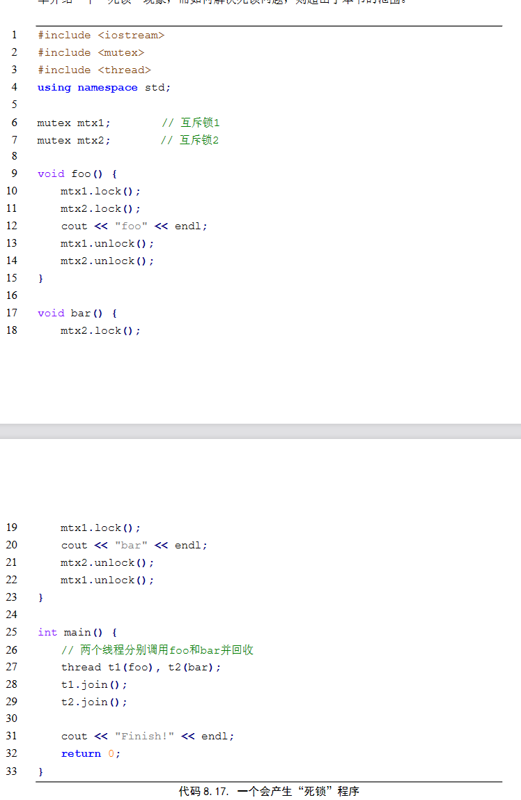

# 并行编程

### 串线程同步-互斥锁//掌握

lock()的在语义上只能让一个调用者返回，另一个调用者必须阻塞，直到拿到改锁的调用者调用 unlock()之后，才能从 lock()中返回

```cpp
void thread::detach ();
void thread::join() ;
bool thread::joinable() const noexcept;
```

这三个方法涉及到线程的状态。

通常在一个线程在调用初始化构造器之后未调用detach()方法时的状态是 joinable 的，这样的线程在生命周期结束后是需要创建这个线程的线程调用 join()方法进行线程状态的回收。

而 detach()方法可以使一个线程的状态变成 not joinable，它在结束后不需要其他线程进行回收。

使用 joinable()方法可以检查一个线程的状态， joinable 返回 true， not joinable 返回 false

### 并发List// 理解

插入时，用互斥锁来保护对head指针的操作


查找时用粗粒度的锁保护整个函数


### 并发散列表 //理解

基于并发链表设计并发散列表，每个散列桶各使用自己的锁。


### 死锁//理解



t1拿到了mtx1()的锁，t2拿到了mtx2()的锁，t1阻塞在第11行，t2阻塞在第19行。

---


A.**共享变量存在数据竞争的原因**:数据竞争产生的原因是由于对于共享变量操作的 **“非原子性”**。非原子性操作是指这样的操作在执行过程中是可能被其他线程打断的。

B.无论是全局静态变量还是局部静态变量，对于各个线程而言都是共享的。

C.锁保护区域的大小会影响程序的性能，我们将锁保护区域的大小称之为锁的粒度。如果一个并发程序中串行的部分越多，那么这个程序的性能就会越差。

D.

---

- 归并排序不仅在时间复杂度上是最优的基于排序的算法，而且该排序算法也具有良好的  并行性。请实现一个多线程版本的归并排序算法，要求：  
  (1) 可以接受一个参数 threadNum 表示最大可以开的线程数；  
  (2) 在排序阶段和归并阶段都可以多线程执行。  
  
  主要想法：创建子进程进行排序和归并，如果线程数没有达到最大则继续创建线程，否则串行进行。
  
  ```javascript
  function merge_sort(arr, threadNum)
      if length(arr) <= 1 then
          return arr
  
      function merge_sort_recursive(arr, threadNum)
          if length(arr) <= 1 then
              return arr
  
          mid = length(arr) / 2
          left = arr[0:mid]
          right = arr[mid:end]
  
          if threadNum > 1 then
              t1 = create_thread(merge_sort_recursive, left, threadNum / 2)
              t2 = create_thread(merge_sort_recursive, right, threadNum / 2)
              start_thread(t1)
              start_thread(t2)
              join_thread(t1)
              join_thread(t2)
          else
              left = merge_sort_recursive(left, threadNum)
              right = merge_sort_recursive(right, threadNum)
  
          return merge(left, right)
  
      function merge(left, right)
          result = []
          i = 0
          j = 0
  
          while i < length(left) and j < length(right) do
              if left[i] <= right[j] then
                  append result, left[i]
                  i = i + 1
              else
                  append result, right[j]
                  j = j + 1
  
          append remaining elements of left to result
          append remaining elements of right to result
  
          return result
  
      return merge_sort_recursive(arr, threadNum)
  ```

- 矩阵乘法是在数值计算、机器学习等领域中运用广泛的一种操作，对性能的影响也很大。  增加并行性是一种常见的对于矩阵乘法加速的算法，请实现一种N × N矩阵乘法的多线程版本，要求：使用模板类定义矩阵，模板指定元素的类型和N的大小。
  
  *考虑到矩阵乘法是一个重复操作过程，即将矩阵 A 的不同行与矩阵 B 的不同列相乘，且各个相乘结果之间不存在互相依赖关系，容易想到利用多线程计算来对矩阵乘法的计算过程进行加速。*
  
  ```cpp
  //---------------多线程操作函数:不考虑CPU与线程数上限------------
  //-----i行i列单独计算----------------------
  void Thread(int *p){
      int row=p[0];
      int col=p[1];
      int res=0;
      int l;
      for(l=0;l<n;l++)
          res+=a[row][l]*b[l][col];
      result[row][col]=res;
  }
  //////////////////////////////////////////////////////////////
  start1=clock();//获得开始时间
  
  for(i=0;i<n;i++)
      for(j=0;j<n;j++){
          pass[i][j][0]=i;
          pass[i][j][1]=j;
              r=pthread_create(&thid[i][j],NULL,(void*)Thread,pass[i][j]);
              pthread_join(thid[i][j],NULL);//!!!!!!!!!!!!
    }
  
  finish1=clock();//获得结束时间使用多线程实现一个递归版本的斐波那契数列计算，空间复杂度是O(1)。注意，如果每  一层递归都开一个线程去完成，线程数会呈几何级数上升，消耗大量内存资源。故，要  求可以接受一个参数 threadNum 表示最大可以开的线程数。
  
  ```
  
  创建一定数量的线程，并固定在那里，形成一个队列，然后把矩阵乘法看作一定数量的子任务的集合，显然每个子任务就是一个行列相乘并相加。
  
  然后把这些子任务分配给线程执行，线程执行完了之后也不销毁，等待下一个任务的到来，直到所有的任务执行完毕后再销毁。(可以参考lab里的文件)

- 使用多线程实现一个递归版本的斐波那契数列计算，空间复杂度是O(1)。注意，如果每  一层递归都开一个线程去完成，线程数会呈几何级数上升，消耗大量内存资源。故，要  求可以接受一个参数 threadNum 表示最大可以开的线程数。

- 
