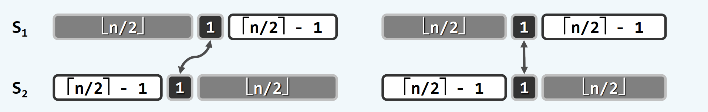
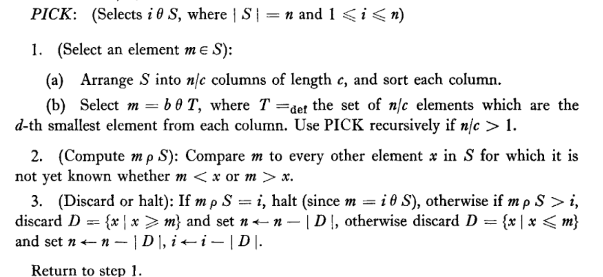
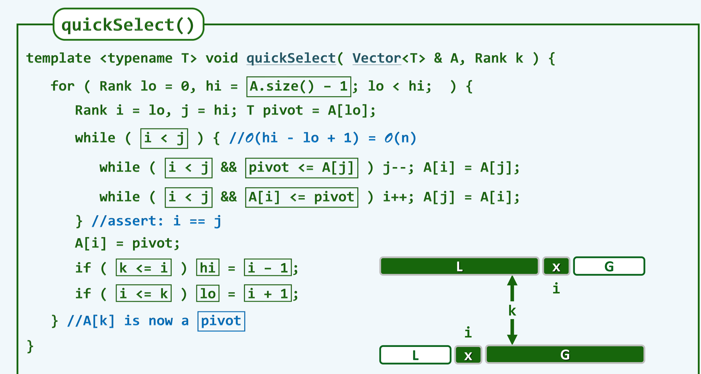
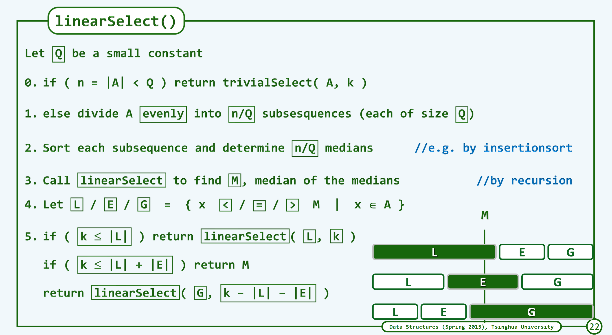

# 众数和中位数

### 减治法基本原理

若向量A的前缀P（|P|为偶数）中，元素x出现的次数恰占半数，则A有众数仅当A-P有众数m,m就是A的众数

假设A含有众数，则:

$x=m$ ,在排除P之后，m与其他元素在数量上的差距保持不变；

算法：

```cpp
int majEleCandidate(vector<int> A){
    int maj;//众数
    for(int c = 0,i = 0;i < A.size();i++){
    if(c == 0){//c代表当前选出众数的个数
        maj = A[i];
        c = 1;
    }
    else
    maj = A[i]?c++:c--;
    }
    return maj;
}
```

#### 中位数算法 // 基本概念

归并向量的中位数：

减而知之，对于两个等长子向量S1,S2：

- 分别选取两个子向量的中位数$m_1$,$m_2$

- $m_1=m_2$,同时为S1,S2,S的中位数)
  
  

- $m_1 \lt m_2 $,则S1左侧所有点均小于等于m1，肯定不是中位数，S2右侧所有点≥m2,肯定不是中位数，两区间舍弃，将S1更改为S1右侧区间，S2更改为S2左侧区间。

- 反之取S1左半，S2右半

#### BFPRT算法 //基本概念

(选出一串数中按顺序排列的第k个数)





- 平均分成n/Q组数，每一组排序，找出各组中位数，并找出所有中位数的中位数M。

- 将所有数分为中位数小于M,等于M,大于M三组

- 若需要查找的数的rank比L的数目小，则从左侧查找；比L+E数目大则在右侧找；否则结果为所找出的中位数。

---

## QuickSelect与QuickSort

▪QuickSelect：平均是 O(n)

▪QuickSort：平均是O(nlogn)

▪QuickSelect：T(n) = n + T(n/2)

▪QuickSort：T(n) = n + 2T(n/2)

▪Master Theorem：T(n) = aT(n/b) + f(n)

### Linear Select

本质是为了防止QuickSelect出现最坏情况

##### LinearSelect的算法复杂度

▪Divide n elements into groups of 5

▪Select median of each group (⇒ Гn/5⅂ selected elements)

▪Use Select recursively to find median q of selected elements

▪Partition all elements based on q

▪Use Select recursively to find i’th element

▪T(n)= Θ(n)+T(n’)+Θ(n)+T(Гn/5⅂)
